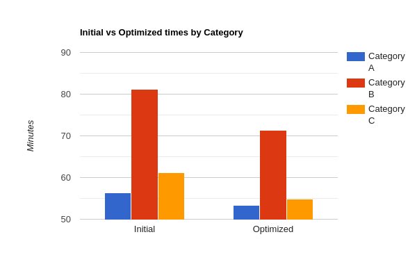

# Set-up instructions

- Clone this repository.
- Run `pip install -r requirements.txt`.
- Run `main.py` in order to run the simulation with the initial placement and with the optimized placement strategy.

# Problem Definition

**Objective**: Develop a Python script that optimizes the positioning of goods in a warehouse based on category-specific placement rules and historical activity logs, aiming to minimize operational time.
**Scenario**: The warehouse contains two racks facing each other, each consisting of 10 bays with 4 shelves per bay. Each shelf hosts up to 3 europallets ($b_{pallet} = 0.8m$) side-by-side. Categories of goods are defined with specific placement rules:
- **Category A**: Only placed on the bottom shelves.
- **Category B**: Only placed on the top shelves.
- **Category C**: Can be placed on any shelf.

Goods are delivered and retrieved from the warehouse with a designated drop-off area at one end of the aisle and a pickup area at the other end. Logs of placements and retrievals for a month. During a typical day, goods to be delivered to the warehouse are the first to be positioned and then the retrieval process starts.

# Clarifications

The input log does not adhere to the placement rules for categories A and B, so for the initial placement simulation I used only the rack and bay data for these categories, while for category C I used the shelf data as well.

How distance to bay is calculated:

For placement:

$$d_1 + bay \\_ id \times b_{rack} + b_{rack} \div 2$$

For retrieval:

$$d_2 + (bays \\_ per \\_ rack -  bay \\_ id) \times b_{rack} + b_{rack} \div 2$$

Where $b_{rack} \div 2$ is the distance needed for the forklift to get centered to the bay.

I also took into account the time need for the forklift to place/retrieve a pallet on a shelf. I set it to $t_{placement} = t_{retrieval} = 1 s$.  

Regarding the stock deficit that might exist, there is  the `add_preexisting_stock` function which is called at the beginning of each day, and it stocks the warehouse if needed. The placement retrieval times of this function are not taken into account, since it's the same both for the initial and the optimized placement.

# Optimization strategy

My solution includes a heuristic solution, meaning that it's tailored to this specific warehouse structure and item category restrictions.

### Category A:

Since the outputs are more than the inputs, we want to prioritize retrieval times over placement times, thus the aim is to place them closest to the pick-up area.

We aim for bays 6, 5 in order to be close to the pick-up area, without compromising placement times too much.

#### Time gain with this approach

Initial placement time = 31.9 minutes

Initial retrieval time = 24.5 minutes

Optimized placement time = 27.1 minutes

Optimized retrieval time = 26.2 minutes

Total time gain = 3.1 minutes

#### Distance gain with this approach

Initial placement distance = 2173.0 meters

Initial retrieval distance = 1626.5 meters

Optimized placement distance = 1849.0 meters

Optimized retrieval distance = 1749.5 meters

Total distance gain = 201 meters

### Category B:
Since the inputs are more than the outputs, we want to prioritize placement times over retrieval times, thus the aim is to place them closest to the drop-off area.

We aim for bays 4, 5 in order to be close to the drop-off area, without compromising retrieval times too much.

#### Time gain with this approach

Initial placement time = 49.8 minutes

Initial retrieval time = 31.4 minutes

Optimized placement time = 30.0 minutes

Optimized retrieval time = 41.4 minutes

Total time gain = 9.8 minutes

#### Distance gain with this approach

Initial placement distance = 2214.5 meters

Initial retrieval distance = 1059.5 meters

Optimized placement distance = 1131.5 meters

Optimized retrieval distance = 1779.5 meters

Total distance gain = 363 meters

### Category C:
Since the inputs vs outputs are almost equal, we want a compromise between placement times and retrieval times, thus the aim is to place them in the middle of the aisle.

We start from the middle, and if the bay is full we go towards the left (to the drop-off area) because to the right there is a high chance that the bottom shelves will be full with category A items, thus adding lift time to the operation.

#### Time gain with this approach

Initial placement time = 36.6 minutes

Initial retrieval time = 24.5 minutes

Optimized placement time = 28.3 minutes

Optimized retrieval time = 26.6 minutes

Total time gain = 6.2 minutes

#### Distance gain with this approach

Initial placement distance = 2086.5 meters

Initial retrieval distance = 1358.0 meters

Optimized placement distance = 1757.5 meters

Optimized retrieval distance = 1775.0 meters

Total distance difference = -106.2 meters

The distance might have increased, but the time has been decreased due to reduced lift times

## Overall gains

Total placement time with initial placement: 118.4 minutes

Total retrieval time with initial placement: 80.4 minutes

Total placement distance covered with initial placement: 6474.0 meters

Total retrieval distance covered with initial placement: 4044.0 meters

Total time with initial placement: 198.9 minutes

Total distance covered with initial placement: 10518.0 meters

Total placement time with optimized placement: 85.5 minutes

Total retrieval time with optimized placement: 94.2 minutes

Total placement distance covered with optimized placement: 4738.0 meters

Total retrieval distance covered with optimized placement: 5304.0 meters

Total time with optimized placement: 179.7 minutes

Total distance covered with optimized placement: 10042.0 meters

**Total time gain = 198.9 - 179.7 = 19.2 minutes**

**Total distance gain = 10518 - 10042 = 476 meters**

*Note: the increased activity on rack 1 bay 10 is due to the handling of the stock deficit for each day.*

As we can see from the heatmaps, the optimized solution follows a more balanced 
approach between placement and retrieval times. 
